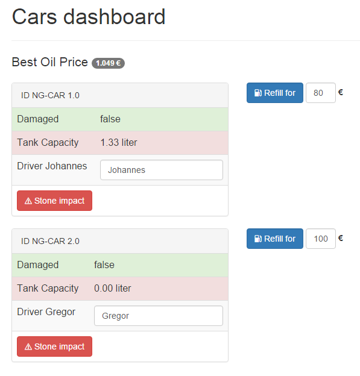

# Dependecy Injection und Unit-Testing mit Angular 2.0

## Dependecy Injection gute Testbarkeit waren schon immer ein Alleinstellungsmerkmal für AngularJS. Mit der neuen Version wurden viele Details verbessert.

> **Hinweis** Das hier gezeigte Beispiel nutzt eine Vorschauversion von Angular 2.0. Der gezeigte Code muss für spätere Versionen wahrscheinlich angepasst werden.

## Einleitung

In den beiden vorangegangenen Artikeln zu Angular 2.0 wurde zunächst ein modulares Setup auf Basis von SystemJS beschrieben. In der zweiten Ausgabe haben wir Ihnen anhand einer Beispielanwendung die neue Template-Syntax vorgestellt. Es wird Zeit, der Anwendung neue Funktionen zu geben, professionelle Entwurfsmuster anzuwenden und Fehlerfreiheit des Codes mit Unit-Tests zu beweisen!


## Inversion of Control

Das Dashboard war die Demo-Anwendung aus der letzten Ausgabe. Im Dashboard soll man nun Informationen zum aktuell günstigsten Benzinpreis erhalten. 


> Screenshot: Mit dem günstigsten Benzinpreis die Autos betanken

Wenn man an einer beliegen Stelle im Programmcode eine andere Funktionalität benötigt, dann liegt es zunächst nahe, jene andere Funktionalität an Ort und Stelle zu initialisieren. Ein erster Ansatz könnte wie folgt ausschauen:

```javascript
var Dashboard = function() {
  this.gasService = new GasService();
  
  // gasService verwenden
  this.gasService.getBestPrice();
}
```


Dieses Vorgehen ist prinzipiell einwandfrei - nur stößt man mit zunehmender Menge an Code an eine Grenze. Der Code wird zunehmend unübersichtlicher, schwerer zu Warten und verweigert sich einem einfachen Test-Setup. Das Problem lässt sich dadurch begegnen, dass man die Verantwortung zum Erzeugen von Abhängigkeiten an eine übergeordnete Stelle abgibt. 

Dies ist die Idee hinter dem Prinzip des **"Inversion of Control"**. Bei diesem Prinzip kehrt man die Verantwortlichkeit einfach um. Das Prinzip findet sich in verschiedenen Entwurfsmustern in allen Programmiersprachen wieder. AngularJS zum Beispiel verwendet das Entwurfsmuster **"Dependency Injection"**. Ein Framework im Kern von AngularJS sorgt dafür, das die benötigte Abhängigkeit identifiziert wird und der Konstruktor-Funktion beim Aufruf bereit gestellt wird. In AngularJS 1.x kann man einen Service wie folgt anfordern:

```javascript
// AngularJS 1.x 
var Dashboard = ['GasService', function(GasService) {
  this.gasService = GasService;
}]
```

Wer das DI-Framework aus AngularJs 1.x kennt, der wird mit Sicherheit auch an dessen Grenzen gestoßen sein. Besonders hinderlich sind fehlende Namespaces und die Notwendigkeit, stets alle Abhängigkeiten per Name zu identifizieren. Dies ist doppelter Schreibaufwand. Im vorliegenden Beispiel muss man zum Beispiel zwei mal "GasService" schreiben.

## Dependency Injection mit Angular 2.0

 Mit der Unterstützung von ECMAScript 6 bzw. von TypeScript wird die Bedienung nun viel vertrauter. So lässt sich mittels des Decorators `@Inject` die Abhängigkeit in den Konstruktor injizieren:

```js
class GasService {
}

class Dashboard {
  constructor(@Inject(GasService) gasService) {
    console.log('Dependency:', gasService)
  }
}

var injector = Injector.resolveAndCreate([Dashboard, GasService]);
var dashboard = injector.get(Dashboard);
```
> Listing 1: Constructor Injection mit ES6

Die Methode `resolveAndCreate()` erzeugt einen einsatzbereiten Injector. Die Methode akzeptiert ein Array aus Typen oder Providern. Wird nur ein Typ übergeben, so wird ein entsprechende Provider für diesen Typ erzeugt. Sofern man TypeScript einsetzt, kann man die Schreibweise noch etwas mehr vereinfachen. Durch die Verwendung von Typen, kann man auf den Decorator `@Inject` verzichten:

```js
@Injectable()
class Dashboard {
  constructor(gasService: GasService) {
    console.log('Dependency:', gasService)
  }
}
```
> Listing 2: Constructor Injection mit TypeScript


Damit dieses Beispiel funktioniert, muss TypeScript einen Hinweis dazu erhalten, dass die Konstruktor mit Dekoratoren versehen werden soll. Dies geschieht mit dem Dekorator `@Injectable()`. Das erzeugte JavaScript aus Listing 1 und Listing 2 unterscheidet sich schlussendlich kaum voneinander. Auf die Verwendung von `@Injectable()` kann verzichtet werden, sobald ein anderer Decorator die Klasse verziert. Weitere Dekoratoren sind etwa `@Component()`, `@View` oder `@RouteConfig`. Da Angular 2.0 stark auf einen deklarativen Stil mittels Dekoratoren setzt, benötigt man `@Injectable()` eigentlich nur für Service-Klassen.

## Injector, Provider und Dependencies


## Durchstarten

Die Methode `resolveAndCreate()` kann man gut für ein schnelles Experiment oder in einem Unit-Test verwenden. Bei der Erstellung der eigentlichen Anwendung bedient man sich aber der bereits bekannten `boostrap` Methode. Zuvor haben wir bei dieser Methode nur den  ersten Parameter verwendet. Er gibt die Einsteigs-Komponente der Anwendung an - also die Dashboard-Komponente.

```js
// app.ts

import {bootstrap} from 'angular2/angular2';
import Dashboard from './components/dashboard/dashboard.component';

bootstrap(Dashboard);
```
> Listing X: Starten (bootstrapping) der Anwendung

Als zweiten Parameter akzeptiert die Methode wiederum ein Array aus Typen oder Providern. Sollte die Dashboard-Komponente oder eine andere Komponente den GasService benötigen, so lässt sich dieser wie folgt registrieren:

```js
import {bootstrap} from 'angular2/angular2';
import Dashboard from './components/dashboard/dashboard.component';
import GasService from './models/gasService';

// app.ts
bootstrap(Dashboard, [GasService]);
```
> Listing X: Bootrapping mit Registrierung des Dependency GasService


<hr>

## Über die Autoren


**Johannes Hoppe** ist selbstständiger IT-Berater, Softwareentwickler und Trainer. Er arbeitet derzeit als Architekt für ein Portal auf Basis von .NET und AngularJS. Er bloggt unter http://blog.johanneshoppe.de/ .


**Gregor Woiwode** ist als Softwareentwickler im Bereich des Competitive Intelligence bzw. Enterprise Knowledge Managements für ein Softwareunternehmen in Leipzig tätig. Er veranstaltet Trainings AngularJS. Er bloggt unter http://www.woiwode.info/blog/ .

<hr>

[1]: https://angular.io/docs/js/latest/quickstart.html "5 Minuten Schnellstart"
[2]: https://github.com/ModuleLoader/es6-module-loader "ES6 Module Loader Polyfill"
[3]: https://github.com/google/traceur-compiler "Traceur"
[4]: http://babeljs.io/ "Babel"
[5]: https://github.com/Microsoft/TypeScript/ "TypeScript"
[6]: https://github.com/systemjs/systemjs "SystemJS"
[7]: https://github.com/gulpjs/gulp "Gulp"
[8]: https://github.com/angular/angular "Angular 2.0 Github-Repository"
[9]: https://code.angularjs.org/ "code.angularjs.org"
[10]: https://www.npmjs.com/package/systemjs-builder "SystemJS Build Tool"
[12]: https://www.npmjs.com/package/angular2 "NPM-Paket von Angular 2.0"
